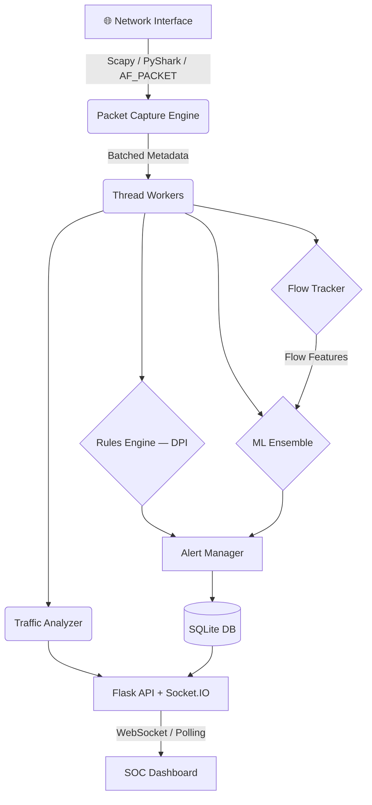

<p align="center">
  <h1 align="center">🛡️ DeepSight NIDS</h1>
  <p align="center">
    <strong>AI-Powered Network Intrusion Detection System</strong>
  </p>
  <p align="center">
    <a href="#-features"></a>
    <a href="#-ml-anomaly-detection"></a>
    <a href="#-quick-start"></a>
    <a href="#-api-reference"></a>
    <a href="#license"></a>
  </p>
</p>

<br>

> **DeepSight** is a full-stack Network Intrusion Detection System that combines **Deep Packet Inspection**, **Stateful Flow Analytics**, and **Machine Learning anomaly detection** to monitor live network traffic and surface threats through a real-time SOC-style dashboard.

---

## 📑 Table of Contents

- [Architecture](#-architecture)
- [Features](#-features)
- [ML Anomaly Detection](#-ml-anomaly-detection)
- [Quick Start](#-quick-start)
- [Configuration](#%EF%B8%8F-configuration)
- [SOC Dashboard](#-soc-dashboard)
- [API Reference](#-api-reference)
- [Attack Simulation Suite](#-attack-simulation-suite)
- [Project Structure](#-project-structure)
- [Limitations](#-limitations)
- [License](#license)

---

## 🏗 Architecture



| Layer | Technology | Role |
|-------|-----------|------|
| **Capture** | Scapy · PyShark · AF_PACKET | Raw packet ingest with multi-threaded workers |
| **Detection** | Custom DPI rules engine | Signature-based pattern matching |
| **Intelligence** | Feodo C2 · Tor exits · AbuseIPDB · OTX | Threat feed correlation & IP reputation |
| **ML** | Isolation Forest · One-Class SVM · Autoencoder | Behavioral anomaly detection |
| **Storage** | SQLite | Alerts, packets, model versions |
| **Dashboard** | Flask + Socket.IO + Vanilla JS | Real-time SOC interface with geo-mapping |

---

## ✨ Features

### 🔎 Detection Engine
- **Port Scanning** — Horizontal & vertical scan detection with configurable thresholds
- **Brute Force** — SSH, FTP, RDP, MySQL login attempt monitoring
- **SYN / ICMP / UDP Flood** — Volumetric DDoS detection
- **DNS Amplification** — Oversized DNS response detection
- **Stealth Scans** — NULL, Xmas, and FIN scan identification
- **ARP Spoofing** — Layer 2 MITM detection
- **Slow Scans** — Low-and-slow reconnaissance via ML entropy analysis

### 🔬 Deep Packet Inspection
- HTTP URI & User-Agent fingerprinting
- PowerShell command payload detection
- TLS ClientHello detection & JA3 hash matching
- DNS query name extraction
- C2 beacon pattern recognition

### 🌍 Threat Intelligence
- **Feodo Tracker** — Known botnet C2 IP correlation
- **Tor Exit Nodes** — Anonymous relay detection
- **AbuseIPDB** — Real-time IP abuse scoring
- **AlienVault OTX** — Threat pulse integration
- **GeoIP Mapping** — Geographic source visualization

### 📊 SOC Dashboard
- Real-time alert feed with severity classification
- Interactive world map showing attack origins
- Traffic analytics (PPS, bandwidth, protocol distribution)
- Alert timeline with MITRE ATT&CK mapping
- One-click IP blocking and alert acknowledgement
- ML model health metrics and drift monitoring
- SIEM export (JSON / CEF / CSV)
- Incident report generation (HTML)

---

## 🤖 ML Anomaly Detection

The ML engine runs an **ensemble** of three models that vote on anomaly detection:

| Model | Algorithm | Purpose |
|-------|-----------|---------|
| **Isolation Forest** | `sklearn.ensemble.IsolationForest` | Primary anomaly detector — isolates outliers via random partitioning |
| **One-Class SVM** | `sklearn.svm.OneClassSVM` | Secondary boundary detector — defines normal traffic hyperplane |
| **Autoencoder** | Pure NumPy neural network | Reconstruction error detector — high MSE = anomalous pattern |

**Feature extraction** (18 behavioral features per 5-second IP window):
- SYN/ACK/RST ratios · Packet inter-arrival deviation
- Per-flow byte/packet counts · Port Shannon entropy
- DNS query frequency · Payload size distribution

**Capabilities:**
- Online learning with periodic retraining
- Model versioning with rollback support
- Concept drift detection (PSI per feature)
- Dataset training pipeline (CICIDS2017 / UNSW-NB15)

---

## 🚀 Quick Start

### Prerequisites
- **Python 3.10+**
- **pip** (Python package manager)
- *(Optional)* Docker & Docker Compose

### Option 1: Local Install

```bash
# Clone the repository
git clone https://github.com/<your-username>/DeepSight-NIDS.git
cd DeepSight-NIDS

# Install core dependencies
pip install -r requirements.txt

# Start the dashboard (auto-enters Demo Mode on Windows / non-root)
python main.py
```

Open **http://localhost:5000** in your browser.

> **💡 Demo Mode** activates automatically when not running as root (Linux) or on Windows. It generates synthetic attack traffic so the dashboard is fully functional without live capture.

### Option 2: Docker

```bash
docker-compose up -d --build
```

Navigate to **http://localhost:5000**.

### Option 3: Live Capture (Linux, root required)

```bash
sudo python main.py
```

Edit the network interface in `config.yaml`:
```yaml
network:
  interface: eth0        # wlan0, ens3, etc.
  capture_filter: ""     # BPF filter, e.g. "tcp port 80"
  promiscuous: true
```

---

## ⚙️ Configuration

Create a `config.yaml` in the project root to override defaults:

```yaml
network:
  interface: eth0
  worker_threads: 4
  packet_buffer: 20000

database:
  path: data/nids.db

ml:
  enabled: true
  contamination: 0.05       # Expected anomaly ratio
  n_estimators: 50
  min_samples: 50

brute_force:
  threshold: 5              # Max attempts before alert
  time_window: 60           # Seconds

syn_flood:
  threshold: 100
  time_window: 10

port_scan:
  threshold: 20
  time_window: 10

threat_intel:
  abuseipdb_key: ""         # Free at abuseipdb.com
  alientvault_key: ""       # Free at otx.alienvault.com
```

**Environment Variables:**
| Variable | Default | Description |
|----------|---------|-------------|
| `NIDS_PORT` | `5000` | Dashboard port |
| `NIDS_HOST` | `0.0.0.0` | Bind address |
| `NIDS_WORKER_THREADS` | `2` | Capture worker threads |
| `NIDS_PACKET_BUFFER` | `10000` | Packet buffer size |
| `NIDS_ML_CONTAMINATION` | `0.05` | ML contamination factor |

---

## 🖥 SOC Dashboard

The web-based SOC dashboard provides real-time visibility into network threats:

- **Alert Feed** — Live stream of detected intrusions with severity levels (CRITICAL / HIGH / MEDIUM / LOW)
- **World Map** — Geographic visualization of attack source IPs
- **Traffic Graphs** — Real-time PPS, bandwidth, and protocol distribution charts
- **Alert Timeline** — Historical view with time-bucket aggregation
- **MITRE ATT&CK** — Tactic & technique breakdown of detected attacks
- **Packet Inspector** — Recent packet metadata and flow details
- **IP Management** — Block/unblock IPs and view reputation scores
- **ML Console** — Model health, drift status, and manual retrain controls
- **Reports** — Generate and download HTML incident reports

---

## 📡 API Reference

### Core Endpoints

| Method | Endpoint | Description |
|--------|----------|-------------|
| `GET` | `/` | Dashboard UI |
| `GET` | `/api/health` | Health check & uptime |
| `GET` | `/api/stats` | Live traffic + ML + capture stats |
| `GET` | `/api/alerts` | Recent alerts (`?limit=N&severity=HIGH`) |
| `GET` | `/api/alerts/search` | Full-text alert search |
| `GET` | `/api/traffic` | Traffic snapshot |
| `GET` | `/api/packets` | Recent packet metadata |
| `GET` | `/api/blocked` | Blocked IP list |
| `GET` | `/api/poll` | Real-time event polling (`?ns=/nids&since=<epoch>`) |

### Alert Management

| Method | Endpoint | Description |
|--------|----------|-------------|
| `POST` | `/api/block` | Block IP `{"ip": "1.2.3.4"}` |
| `DELETE` | `/api/unblock/<ip>` | Unblock IP |
| `POST` | `/api/alerts/<id>/ack` | Acknowledge alert |
| `POST` | `/api/alerts/feedback` | Analyst feedback |

### ML Operations

| Method | Endpoint | Description |
|--------|----------|-------------|
| `GET` | `/api/ml/info` | Model metadata |
| `GET` | `/api/ml/evaluate` | Precision, recall, FPR metrics |
| `GET` | `/api/ml/versions` | Saved model versions |
| `POST` | `/api/ml/rollback/<version>` | Rollback model |
| `GET` | `/api/ml/drift` | Concept drift (PSI) |
| `POST` | `/api/ml/retrain` | Force retrain |
| `POST` | `/api/ml/train/dataset` | Train from CICIDS / UNSW-NB15 |

### Threat Intelligence

| Method | Endpoint | Description |
|--------|----------|-------------|
| `GET` | `/api/reputation/<ip>` | IP reputation lookup |
| `GET` | `/api/abuseipdb/<ip>` | AbuseIPDB lookup |
| `GET` | `/api/otx/<ip>` | AlienVault OTX lookup |
| `POST` | `/api/ti/refresh` | Refresh threat feeds |

### Reporting & Export

| Method | Endpoint | Description |
|--------|----------|-------------|
| `GET` | `/api/timeline` | Alert timeline buckets |
| `GET` | `/api/mitre/stats` | MITRE ATT&CK breakdown |
| `GET` | `/api/siem/export` | SIEM JSON export |
| `GET` | `/api/siem/cef` | CEF syslog format |
| `GET` | `/api/siem/csv` | CSV export |
| `POST` | `/api/reports/generate` | Generate HTML report |
| `GET` | `/api/reports/<file>` | Download report |

---

## ⚔️ Attack Simulation Suite

Located in `attack_simulation/`, these scripts validate detection capabilities:

```bash
# Run all simulations in sequence
./attack_simulation/run_simulations.sh

# Individual tests
./attack_simulation/nmap_scan.sh      # Vertical port scan
./attack_simulation/slow_scan.sh      # T1 stealth scan (tests ML)
./attack_simulation/hping_flood.sh    # SYN flood
./attack_simulation/dns_amp.sh        # DNS amplification
./attack_simulation/hydra_brute.sh    # Brute force attack
```

### Offline ML Evaluation

```bash
python evaluate_ml.py
```

Outputs True Positive rate, False Positive rate, Precision, and Recall across simulated attack vectors.

---

## 📁 Project Structure

```
DeepSight-NIDS/
├── main.py                 # Application entry point
├── app.py                  # Flask API + Socket.IO server (30+ endpoints)
├── packet_capture.py       # Multi-backend capture engine (Scapy/PyShark/AF_PACKET)
├── attack_detection.py     # Rule-based DPI detection engine
├── ml_detector.py          # ML ensemble (Isolation Forest + SVM + Autoencoder)
├── flow_tracker.py         # Stateful TCP/UDP flow tracking
├── traffic_analyzer.py     # Real-time traffic statistics
├── alert_manager.py        # Alert lifecycle management
├── database.py             # SQLite data layer
├── threat_intel.py         # Threat feed ingestion & IP reputation
├── geo_lookup.py           # GeoIP resolution (ip-api.com fallback)
├── report_generator.py     # HTML incident report builder
├── slow_scan_detector.py   # Low-and-slow scan detection
├── email_alert.py          # Email notification integration
├── slack_alert.py          # Slack webhook alerts
├── logger.py               # Structured logging
├── evaluate_ml.py          # Offline ML model evaluation
├── flask_cors.py           # CORS stub (zero-dependency fallback)
├── flask_socketio.py       # Socket.IO stub (polling fallback)
├── index.html              # SOC Dashboard (single-page app)
├── requirements.txt        # Python dependencies
├── Dockerfile              # Container image
├── docker-compose.yml      # Docker Compose deployment
├── config.yaml             # Runtime configuration (not tracked)
├── data/                   # Runtime data (DB, models, PCAPs)
└── attack_simulation/      # Detection validation scripts
    ├── run_simulations.sh
    ├── nmap_scan.sh
    ├── slow_scan.sh
    ├── hping_flood.sh
    ├── dns_amp.sh
    ├── hydra_brute.sh
    └── replay_pcap.sh
```

---

## ⚠️ Limitations

This project is designed as a **portfolio-grade demonstration**. Key limitations for production use:

| Area | Limitation | Production Alternative |
|------|-----------|----------------------|
| **Capture** | Python userspace (~8k–150k pps) | Suricata / Zeek / DPDK / eBPF+XDP |
| **ML Training** | Trains on live traffic (risk of concept poisoning) | Labeled dataset training (CICIDS2017) |
| **JA3 Hashing** | Stub in Scapy mode | Full TLS handshake parsing via tshark |
| **Database** | SQLite (single-writer) | PostgreSQL / TimescaleDB |
| **Scalability** | Single-node | Distributed with Kafka + Elasticsearch |

> See [LIMITATIONS.md](LIMITATIONS.md) for a detailed, honest breakdown.

---

## 🤝 Contributing

1. Fork the repository
2. Create a feature branch (`git checkout -b feature/amazing-feature`)
3. Commit your changes (`git commit -m 'Add amazing feature'`)
4. Push to the branch (`git push origin feature/amazing-feature`)
5. Open a Pull Request

---

## License

This project is licensed under the **MIT License** — see the [LICENSE](LICENSE) file for details.

---

<p align="center">
  <sub>Built with ❤️ for network security research</sub>
</p>
# NIDS

