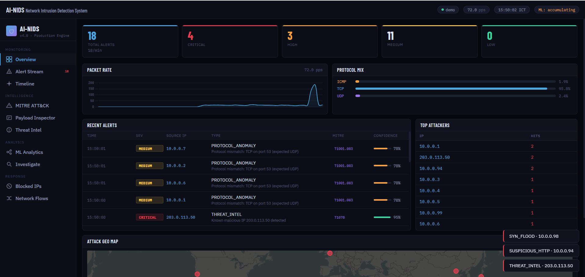
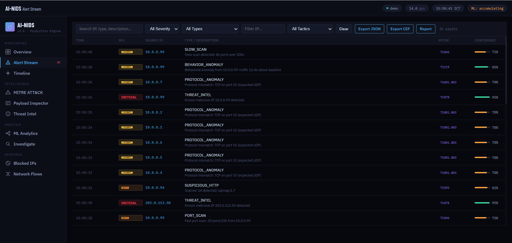
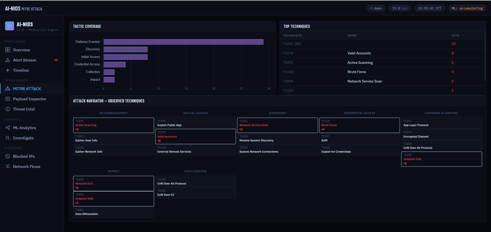
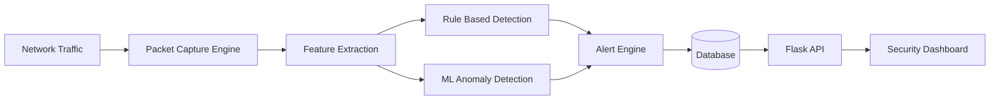

<p align="center">

# DeepSight NIDS

### AI-Powered Network Intrusion Detection System


</p>

---

<p align="center">

</p>

---

# Overview

DeepSight is a **Network Intrusion Detection System (NIDS)** designed to monitor network traffic, detect suspicious behavior, and visualize threats through an interactive security dashboard.

The system combines:

- Packet inspection
- Rule-based intrusion detection
- Machine learning anomaly detection
- Real-time network monitoring
- MITRE ATT&CK threat mapping

This project demonstrates the internal architecture of a modern intrusion detection system and provides a **Security Operations Center style dashboard** for analysis.

---

# Key Features

### Network Monitoring

- Live packet capture
- TCP / UDP / ICMP protocol parsing
- Traffic statistics and packet rate tracking
- Network flow monitoring

### Intrusion Detection

Detects several common attacks including:

- Port scanning
- Brute force attempts
- SYN flood attacks
- Suspicious HTTP traffic
- Protocol anomalies
- Threat intelligence matches

### Machine Learning Detection

DeepSight uses **Isolation Forest** to detect anomalous network behavior.

Traffic features analyzed include:

- Packet frequency
- Connection attempts
- Port entropy
- Traffic deviation from baseline

This enables detection of **unknown and stealth attacks**.

### Security Dashboard

The real-time dashboard includes:

- Live alert stream
- Traffic analytics
- MITRE ATT&CK mapping
- Attack source visualization
- Top attacker statistics

---

# Screenshots

## System Overview

<p align="center">

</p>

Displays traffic statistics, attack distribution, and threat origin tracking.

---

## Alert Monitoring

<p align="center">

</p>

Shows real-time intrusion alerts including severity, attacker IP, and attack type.

---

## MITRE ATT&CK Analysis

<p align="center">

</p>

Maps detected attacks to **MITRE ATT&CK tactics and techniques**.

---

# System Architecture



---

# Installation

### Clone Repository

```bash
git clone https://github.com/hardik-lomate/NIDS.git
cd NIDS
```

### Install Dependencies

```bash
pip install -r requirements.txt
```

### Start Application

```bash
python main.py
```

Open the dashboard:

```
http://localhost:5000
```

---

# Docker Deployment

Run using Docker:

```bash
docker-compose up --build
```

---

# Project Structure

```
NIDS
│
├ main.py
├ app.py
├ packet_capture.py
├ attack_detection.py
├ traffic_analyzer.py
├ ml_detector.py
├ flow_tracker.py
│
├ database.py
├ alert_manager.py
│
├ screenshots
│   ├ nids-overview-dashboard.png
│   ├ alert-stream-dashboard.png
│   └ mitre-attack-dashboard.png
│
├ attack_simulation
│
├ Dockerfile
├ docker-compose.yml
├ requirements.txt
└ index.html
```

---

# Future Improvements

- Deep learning based detection
- Threat intelligence integration
- SIEM compatibility
- Distributed monitoring nodes
- eBPF packet capture

---

# License

MIT License

---

# Author

Hardik Lomate  

Cybersecurity Student  
Network Security & AI Security Research
